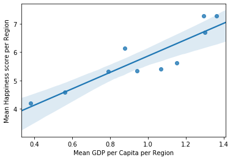
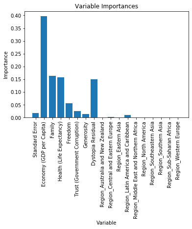
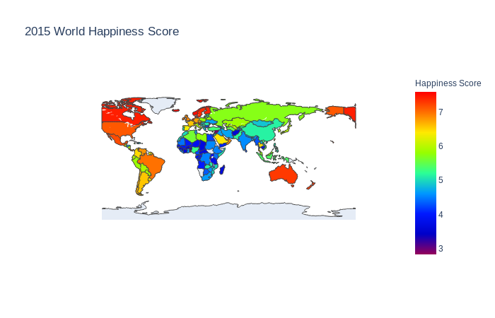

<h1> World Happiness Analysis </h1>
by Mohammad Mushfequr Rahman and Terry Dharmawan Hosea.

To start off, you would want to create a new python enviornment.
You can do this by simply running the script below:

    conda create -n SDA python==3.6
    conda activate SDA
    conda install numpy
    conda install pandas
    conda install matplotlib
    conda install seaborn
    conda install plotly
    conda install scikit-learn

With this your python virtual enviornment should be ready to run. If you donot have conda in your system you can easily download anaconda by referring to the docs at

    https://www.anaconda.com/distribution/#download-section

The following is a summary of the work we did to investigate the correlation between different global factors and a country's happiness score.

We conducted an exhaustive investigation into various different factors and identified key factors that impact the happiness score of a country. Our results can be summarised from the graph below.

We also created a random forest regressor which had a **94.8%** accuracy in predicting the happiness of a certain country. Our regressor was also able to model the importance of each variable in contributing to the accuracy of our model.

The results are summarised in the graph below:

We also created an interactive world map to show the world happiness at a larger extent.

To fully interact with the map and see the full implementation of our analysis please refer to the  ipython notebook. The notebook code can be applied to the 2016 and 2017 datas. The varaible names might change so you might need to account for that.  
